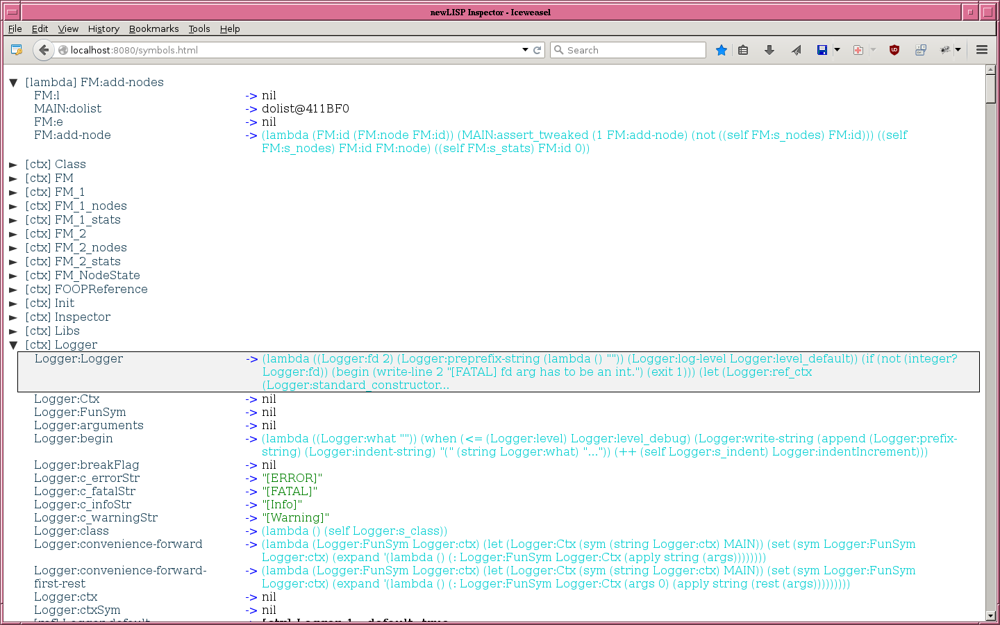

# Inspector

For inspecting a newLISP system.

[Directly to how to start a Demo](#demo), leading to a screenshot like the following:

## Introduction

Easily inspecting a running system
- helps for getting a feeling about its properties, and
- can help a lot during development.

### Inspiration:
In Smalltalk systems out of the last millenium there have been so called 'inspectors' for looking into the properties of life objects.

Essential building blocks of a newLISP system are symbols evaluating to some value. All symbols together with their current evaluations at some point of time are giving very much information about it (though not all).

So here is an 'Inspector' app for inspecting all newLISP symbols: GUI are browser windows, getting their input from a newLISP webserver/webservice process.

Communication between newLISP and the browser is synchronous: after starting the newLISP webservice symbols can be explored by (re)loading
  `http://localhost:8080/symbols.html`,
until (re)loading
  `http://localhost:8080/leave` (*),
which ends it (but it can be restarted).

## Some properties of Inspector

- synchronous communication of GUI with Inspector webservice;
- navigation by mouse and keyboard;
- jump directly to symbols by using hashes/anchors (e.g. http://localhost:8080/#MAIN:MAIN refers to MAIN context symbol);
- context folders structuring symbol space;
- additional folders by double-clicking onto a symbol evaluating to some structure *containing* symbols: like lambdas, macros and lists (this is for getting *related* symbols together into their own folder).

## Demo

There is a demo, which starts Inspector inside a simple counting loop (counting from 1 to 3), so it will be restarted again after leaving it.  
It shows:
- Inspector's functionality,
- how to start Inspector from newLISP, and
- how a _change_ of a variable can be inspected by switching between:
  - start commands from inside a newLISP process (programmatically or typed-in newLISP terminal), and
  - leave commands by loading a leave URI from the browser.

1. Clone this repository and enter it (`REPO_DIR` usually will be `Inspector` somewhere in your filesystem):  
     `cd REPO_DIR`
2. Run  
     `./demo.lsp`  
   or  
     `newlisp demo.lsp`  
   (the latter may be needed, if newlisp path differs from /usr/local/bin/newlisp).
3. Load  
     `http://localhost:8080/symbols.html` (*)  
   from a browser (firefox works).

There is
- some info in the terminal output of the newLISP process about possible user actions;
- some Help at the bottom of page `http://localhost:8080/symbols.html`.

## Limitations

Inspector shows a newLISP system on top
  **as seen from the newLISP programmer.**

It does not show the inner workings of the interpreter like
- call stack, and
- environment stack;

which would be interesting for debugging (a full-featured debugger would need even more for e.g. setting breakpoints).

## Important notes to this piece of software

This is **bleeding edge** software: used infrastructure in INSPECTOR_DIR/modules/ and INSPECTOR_DIR/lib/
- is not stable,
- is not documented for reuse by others,
- is not mature for publishing it as base for other apps,
- may change rapidly without any notice beforehand.

But nevertheless Inspector may be of interest for others
  **as it is now.**

## Ideas for further development

It would be nice to have a more low-level interface to the inner state of the newLISP interpreter for
- inspecting call stack together with environment stack (symbol values not at the top of environment stack are invisible now),
- step by step debugging like in the CLI debugger,
- debugging with breakpoints.

Technically a websocket could be utilized for lightweighted communication between browser and/or intermediate newLISP server process and low-level interface of a to be inspected system.
For a full-featured debugger probably a very low-level communication hook in the interpreter loop of a to be inspected system would be needed - with some websocket code or similar at C level - for:
- querying state of call and environment stacks,
- sending control commands.

## Footnotes

(*) Another port as 8080 could be used, too.
