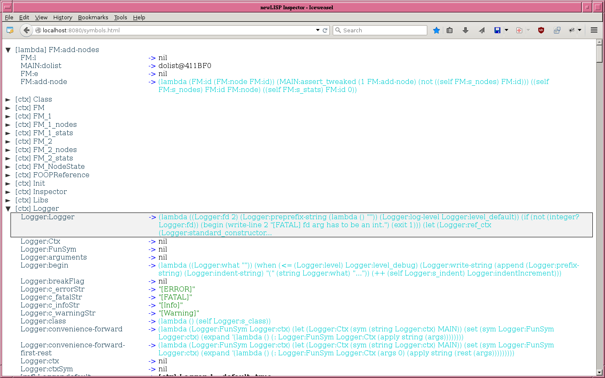
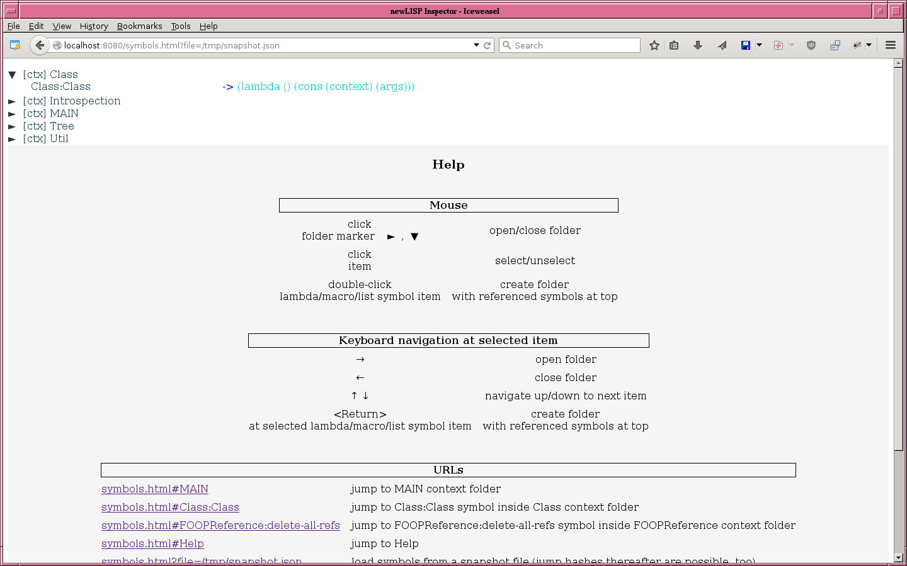

# Inspector

For inspecting a newLISP system.

Directly to [How to start](#how-to-start).

### News

- v0.3: [Ping-pong mode demo](#ping-pong-mode-demo)  
  In ping-pong mode
  - control flow switches between Inspector's server process and browser GUI,
  - changed symbol evaluations will be automatically updated in GUI,

  after triggering it by opening user created lambda/macro/list folders (containing their symbols).

### Screenshots

#### Viewing Inspector's symbols

#### Viewing snapshot'ed symbols of _another_ newLISP process

### Introduction

Easily inspecting a running system
- helps for getting a feeling about its properties, and
- can help a lot during development.

#### Inspiration:
In Smalltalk systems out of the last millenium there have been so called 'inspectors' for looking into the properties of life objects.

Essential building blocks of a newLISP system are symbols evaluating to some value. All symbols together with their current evaluations at some point of time are giving very much information about it (though not all).

So here is an 'Inspector' app for inspecting all newLISP symbols: GUI are browser windows, getting their input from a newLISP webserver/webservice process.

Communication between newLISP and the browser is synchronous: after starting the newLISP webservice symbols can be explored by (re)loading
  `http://localhost:8080/symbols.html`,
until (re)loading
  `http://localhost:8080/leave` (*),
which ends it (but it can be restarted).

### Some properties of Inspector

- synchronous communication of GUI with Inspector webservice;
- navigation by mouse and keyboard;
- jump directly to symbols by using hashes/anchors (e.g. http://localhost:8080/#MAIN:MAIN refers to MAIN context symbol);
- context folders structuring symbol space;
- additional folders by double-clicking onto a symbol evaluating to some structure *containing* symbols: like lambdas, macros and lists (this is for getting *related* symbols together into their own folder).

### How to start

Inspector runs with newLISP 10.6.2 (stable) and 10.6.4 (inprogress); tested under Linux only.

Clone this repository and enter it (`REPO_DIR` usually will be `Inspector` somewhere in your filesystem):  
     `cd REPO_DIR`  
   .

#### Simple start

Showing:
- Inspector's functionality,
- how to start Inspector from newLISP.

1. Run  
     `./startIt.lsp`  
   (starts Inspector).

2. Load  
     `http://localhost:8080/symbols.html` (*)  
   from a browser (firefox works).

There is
- some Help at the bottom of page `http://localhost:8080/symbols.html`.

#### Demos

There are some demos (from less to more advanced).

##### Loop demo

This starts Inspector inside a simple counting loop (counting from 1 to 3), so it will be restarted again after leaving it.  
Showing:
- how a _change_ of a variable can be inspected by switching between:
  - start commands from inside a newLISP process (programmatically or typed-in newLISP terminal), and
  - leave commands by loading the leave URI from the browser.

1. Run  
     `./startIt_loop.lsp`  
   (starts Inspector from inside a loop).
2. Load  
     `http://localhost:8080/symbols.html` (*)  
   from a browser.

There is
- some info in the terminal output of Inspector's newLISP process about possible user actions;
- some Help at the bottom of page `http://localhost:8080/symbols.html`.

##### Snapshot'ing and viewing symbols of _another_ newLISP process

1. Run  
     `./startIt.lsp`  
   .
2. Run  
     `./snapshot.lsp`  
   (this makes a snapshot of a freshly started newLISP instance).
3. Load  
     `http:localhost:8080/symbols.html?file=/tmp/snapshot.json` (*)  
   from a browser (works under Linux, for other OSes another filepath may be needed).

Needed infrastructure for Inspector - `./snapshot.lsp` - is quite big, but for snapshot'ing - `./snapshot.lsp` - only loading of two modules is needed.

##### Ping-pong mode demo

This demo shows a ping-pong-like control flow between Inspector server process and its browser GUI, which works without user interaction after a few preparatory steps: just run  
  `./startIt_pingPong.lsp`  
: info about how to proceed from browser GUI will be shown in its terminal output.

This ping-pong mode is suited for viewing changes of symbol values of some interesting lambda/macro/list in time.
Their symbols will be put together in one or more user created folders in advance (creation simply by double-click or Return). Changed values of these symbols will be automatically updated in browser view, if pinp-pong mode has been triggered by opening all of these user created folders (no buttons needed so far).

Note:  
In opposite to viewing symbols state snapshots of other newLISP processes, whole Inspector infrastructure is needed for ping-pong mode to work.

### Limitations

Inspector shows a newLISP system on top
  **as seen from the newLISP programmer.**

It does not show the inner workings of the interpreter like
- call stack, and
- environment stack;

which would be interesting for debugging (a full-featured debugger would need even more for e.g. setting breakpoints).

### Important notes to this piece of software

This is **bleeding edge** software: used infrastructure in INSPECTOR_DIR/modules/ and INSPECTOR_DIR/lib/
- is not stable,
- is not documented for reuse by others,
- is not mature for publishing it as base for other apps,
- may change rapidly without any notice beforehand.

But nevertheless Inspector may be of interest for others
  **as it is now.**

### Ideas for further development

Note: 'less advanced' does not mean 'less work', but lesser work and risk to get it running as 'more advanced'.

#### Less advanced

Using a websocket connection for two purposes:
- command line interaction with newLISP interpreter in a text window, while
- being able to update symbol's eval state at the same time.

This would need some protocol for interaction and some wrapper around interpreter loop for multiplexing commands for:
- querying symbols's state and their responses (first interaction), and
- interpreter commands and their responses (second interaction).

#### More advanced

It would be nice to have a more low-level interface to the inner state of the newLISP interpreter for
- inspecting call stack together with environment stack (symbol values not at the top of environment stack are invisible now),
- step by step debugging like in the CLI debugger,
- debugging with breakpoints.

Technically a websocket could be utilized for lightweighted communication between browser and/or intermediate newLISP server process and low-level interface of a to be inspected system.
For a full-featured debugger probably a very low-level communication hook in the interpreter loop of a to be inspected system would be needed - with some websocket code or similar at C level - for:
- querying state of call and environment stacks,
- sending control commands.

### Footnotes

(*) Another port as 8080 could be used, too.
