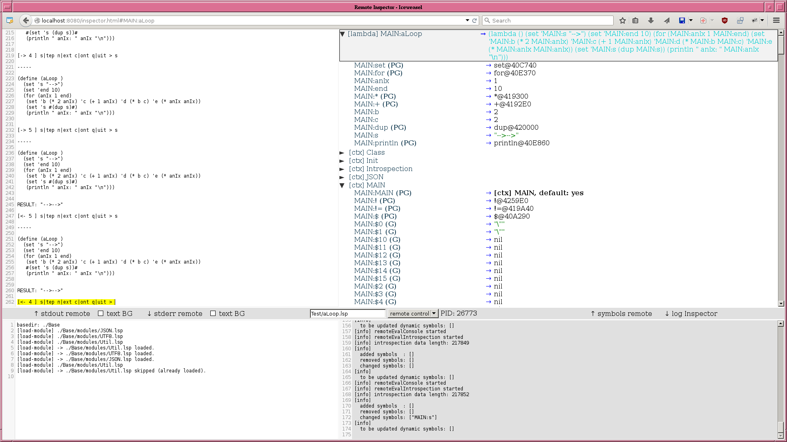
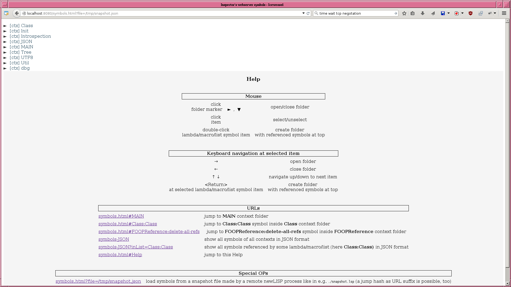

# Inspector

For inspecting a newLISP system.

Directly to [How to start](#how-to-start).

### News

- v0.4: Working horse application of Inspector is 'Remote Inspector' now (big changes in comparison to v0.3)
  An adiitional newLISP process will be started as a remote (a former one is Inspector's webserver process serving the browser GUI), which will be controlled by Remote Inspector's GUI.

  See [Remote Inspector](#remote-inspector) for a description.

- v0.3: [Ping-pong mode demo](#ping-pong-mode-demo)  
  In ping-pong mode
  - control flow switches between Inspector's server process and browser GUI,
  - changed symbol evaluations will be automatically updated in GUI,

  after triggering it by opening user created lambda/macro/list folders (containing their symbols).

### Screenshots

#### Remote Inspector: just after start

#### Remote Inspector: changed layout
Note: mouse pointer at bottom-right corner of remote console gives resize handle.

#### Remote Inspector: debugging session

#### Inspector's webserver's symbols (serving Remote Inspector GUI)

#### Snapshot'ed symbols of some other newLISP process

### Introduction

Easily inspecting a running system
- helps for getting a feeling about its properties, and
- can help a lot during development.

#### Inspiration:
In Smalltalk systems out of the last millenium there have been so called 'inspectors' for looking into the properties of life objects.

Essential building blocks of a newLISP system are symbols evaluating to some value. All symbols together with their current evaluations at some point of time are giving very much information about it (though not all).

So here is an 'Inspector' app for inspecting all newLISP symbols: its GUI are browser windows, getting their input from a newLISP webserver process.

This webserver controls and communicates with a remotely started newLISP instance, and forwards its input and output from/to the browser:
- for the highly interactive parts of communication between webserver (newLISP) and browser (Javascript) a websocket connection is used;
- communication between webserver and remote processes (both newLISP) is done by pipes.

After starting Inspector's webserver a remote can be controlled and its symbols can be explored with Remote Inspector GUI by loading
  `http://localhost:8080/inspector.html` [(1)](#fn_1)  
; an overview page will be shown by visiting
  `http://localhost:8080/`
.

### Remote Inspector

Remote Inspector is the main application - 'working horse' - here.

Remote Inspector (RI) consists of three parts:
- Inspector's webserver for serving RI's GUI runs as a newLISP process, to be started by the user;
- RI's GUI is running inside a browser window with Javascript;
- RI's remote is a newLISP process to be visualized and controlled by RI's GUI.

Communication between remote process (newLISP) and GUI (Javascript) goes via an intermediate webserver process (newLISP).
Because this longer lasting and highly interactive communication will be handled by a forked webserver process, multiple browser window GUIs, each having its own remote, are possible (this allows to compare properties of different remote newLISPs running at the same time).

#### General features of Remote Inspector

- handles newLISP debug and interrupt mode;
- multiple remotes: handles multiple browser windows/tabs each having its own remote;
- flexible layout: after resizing remote console - by dragging a _handle_ at its right/bottom borders - all other widgets are adapted to it;
- communication channels are:
  - a (bidirectional) websocket connection between browser window process (Javascript) and (forked) webserver process (newLISP),
  - pipes between webserver and remote processes (both newLISP);
- UTF-8 clean (this is a longer topic):
  - visualizes originally invalid UTF-8 parts of stdout/stderr output and/or symbol names,
  - all remote output will be transferred suitably quoted to the browser for always getting:
    - valid UTF-8, needed for text transfer via websocket protocol, followed by
    - valid JSON, needing valid UTF-8.

#### Features of Remote Inspector's GUI

Remote interaction from browser window GUI by:
- a 'remote console' widget, mimicking a newLISP interpreter shell inside a terminal;
- a 'remote control' menu-button for starting - with textbox for CLI arguments -, interrupting and terminating it;
- a 'symbols view' widget (a tree control) for inspecting remote's symbols.

Remote console features:
- shows remote's stderr *separated* into an extra window (to see the difference between stdout and stderr);
- support for newLISP's debugging mode, with update of symbols after each step;
- command history twofold:
  - single-line history, and
  - multi-line history;
- continuous output of intermediate results in case of longer lasting evaluations;
 - evaluations may be terminated by interrupting or killing remote.

Remote control features:
- starting it with user defined CLI arguments;
- interrupting it with SIGINT;
- terminating it with SIGTERM/SIGKILL.

Remote symbols view features:
- shows symbol's properties visually and textually;
- standard context folders (containing all of their symbols) structuring symbol namespaces;
- additional user created lambda/macro/list folders - containing their symbols - for targeted inspecting of symbols, which belong together (and may stem from different contexts):
  - created by double-click or return-key onto/at symbol evaluating to lambda/macro/list,
  - created at top of standard context folders (which are always there);
- frequent updates of symbol changes just after *each* normal or debug interpreter prompt (interrupt prompt is special);
- navigation by mouse or keyboard;
- direct jumps to symbols by using hashes/anchors in URL: e.g.
  - `http://localhost:8080/inspector.html#MAIN` jumps to MAIN context folder,
  - `http://localhost:8080/inspector.html#MAIN:$main-args` jumps to MAIN:$main-args symbol inside MAIN context folder (together with opening it).

#### Features of Inspector's webserver

Inspector's webserver provides all needed for Remote Inspector:
- standalone webserver (not something needing another webserver as frontend);
- websocket protocol implementation using forked webserver processes (to be usable in multiple windows/tabs);
- normal features like serving static resources (currently all are preloaded in memory and served from there);
- special Remote Inspector features for controlling a remote newLISP process.

There are special features for another application, too.

#### Important Note

As it is now (and this may never change!), it's *not* suited for opening its served port (default `8080`) to the wild. Please look into [Security Warning](security-warning), which also applies to Inspector's webserver in general.

### Security Warning

This application is capable to look into and manipulate your system.
So you should:
- close port `8080` (or another one) in use here to the outside by some firewall, to
- be not accessible from outside your host or - at least - private network.

You have been warned!

### How to start

Inspector runs with newLISP 10.7.0 (stable) [(2)](#fn_2); it has been tested under Linux (Debian) with browsers Iceweasel (Firefox) and Chromium.

Clone this repository and enter it (`REPO_DIR` usually will be `Inspector` somewhere in your filesystem):  
     `cd REPO_DIR`  
   .

#### Simple start

Explained here:
1. how to start Inspector's webserver, and
2. how to access Remote Inspector's GUI served by it.

1. Run  
     `./startIt.lsp`  
   (starting Inspector's webserver).

2. Load  
     `http://localhost:8080/inspector.html` [(1)](#fn_1)  
   from a browser (firefox works) to get Remote Inspector's GUI.

Notes:
- A remote with simple 'Hello World' startup code will be started automatically;
- there is some more info at '[Inspector] Overview' page at
    `http://localhost:8080/`
  .

#### Snapshot'ing and viewing symbols of an _external_ newLISP process, _not_ being started as a remote from Remote Inspector's GUI

1. Run  
     `./startIt.lsp`  
   .
2. Run  
     `./snapshot.lsp`  
   (this makes a snapshot of a freshly started newLISP instance).
3. Load  
     `http:localhost:8080/symbols.html?file=/tmp/snapshot.json` [(1)](#fn_1)  
   from a browser (works under Linux, for other OSes another filepath may be needed).

Needed infrastructure for Inspector - `./startIt.lsp` - is quite big, but for snapshot'ing - `./snapshot.lsp` - only loading of much fewer code is needed.

### Limitations

Inspector shows a newLISP system on top
  **as seen from the newLISP programmer.**

It does not show the inner workings of the interpreter like
- call stack, and
- environment stack;

which would be interesting for debugging (a full-featured debugger would need even more, e.g. support for setting breakpoints).

### Important notes to this piece of software

This is **bleeding edge** software: used infrastructure in REPO_DIR/modules/ and REPO_DIR/lib/
- is not stable,
- is not documented for reuse by others,
- is not mature for publishing it as base for other apps,
- may change rapidly without any notice beforehand.

But nevertheless Inspector may be of interest for others
  **as it is now.**

### newLISP support which would help now

TODO.

#### Minimal effort maximal win

#### Performance

#### Architecture

### Ideas for further development

Note: 'less advanced' does not necessarily mean 'less work', but lesser work and risk to get it running as 'more advanced'.

#### _Done_ Ideas for further development

Some ideas have been realized.

##### Less advanced

Using a websocket connection for two purposes:
- command line interaction with newLISP interpreter in a text window, while
- being able to update symbol's eval state at the same time.

This would need some protocol for interaction and some wrapper around interpreter loop for multiplexing commands for:
- querying symbols's state and their responses (first interaction), and
- interpreter commands and their responses (second interaction).

##### Realization

- websocket communication between browser and webserver has been implemented;
- symbol's state will be queried from remote and updated in GUI just after each suited - standard and debug - interpreter prompt (interrupt prompt is not suited for this);
- there is a protocol based on JSON messages for the communication between GUI (Javascript) and webserver (newLISP);
- communication between remote and webserver is done raw via pipes (both newLISP processes);
- it is possible to send signals (SIGINT, SIGTERM, SIGKILL) to remote _while_ an evaluation is running;
- prompt-event is used for getting standard prompt event, denoting end of some evaluation;
- stdout output parsing is used for getting debug and interrupt prompt events;
- introspection queries to remote will be done as evaluations being injected after suited prompt events: resulting in JSON data describing symbols' properties.

#### _Undone_ Ideas for further development

Unrealized ideas.

##### Less advanced

'Ping-pong mode'-like functionality - automated triggering of multiple evaluations with updates of symbols in time - by automatically repeating a command send from remote console (Javascript GUI) to remote (newLISP process): therefore only Javascript code had to be extended.

##### More advanced

It would be nice to have a more low-level interface to the inner state of the newLISP interpreter for
- inspecting call stack together with environment stack (symbol values not at the top of environment stack are invisible now),
- step by step debugging like in the CLI debugger,
- debugging with breakpoints.

Technically a websocket could be utilized for lightweighted communication between browser and/or intermediate newLISP server process and low-level interface of a to be inspected system.
For a full-featured debugger probably a very low-level communication hook in the interpreter loop of a to be inspected system would be needed - with some websocket code or similar at C level - for:
- querying state of call and environment stacks,
- sending control commands.

### Footnotes
<a name="fn_1">(1)</a>
Another port as `8080` (default) could be used, too.  
<a name="fn_2">(2)</a>
Inspector may run with older newLISP versions, too; especially v10.6.* is a good candidate.  
